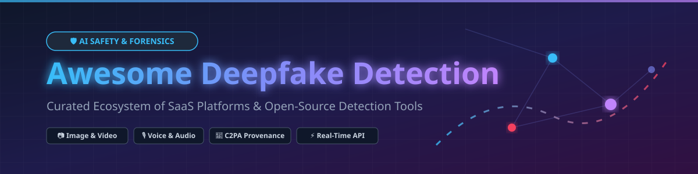

  

# 🛡️ Awesome Deepfake Detection & Synthetic Media Verification 🔍

  
  
  
  

## 🌐 Top Deepfake Detection Platforms Ecosystem ⚡

**Curated List of Enterprise SaaS Products, Forensics SDKs & Open-Source GitHub Projects**

*Focused on Synthetic Media Detection, Voice Cloning Defense, Content Provenance (C2PA) & Real-Time Identity Verification* 🚀

**Last updated: October 2026** 📅

---

### 📊 Market Overview & Industry Dynamics
The global **Deepfake Detection & Media Forensics Market** is estimated at **$1.2 Billion in 2026** and is projected to expand rapidly due to rising enterprise fraud, biometric spoofing, and election misinformation threats. The market is **moderately fragmented**, featuring specialized enterprise security category leaders (such as Reality Defender, Sensity AI, and GetReal Security) alongside hardware/platform integrations (Intel, Microsoft Teams native detection). However, strong network effects around threat intelligence datasets and proprietary detection models are gradually shifting high-assurance security towards a **consolidated enterprise tier**.

---

This repository tracks top **SaaS platforms** 🏢 and **open-source projects** 🔓 for **Deepfake Detection**. These tools help security engineers, fraud prevention teams, and media forensics analysts detect AI-generated and manipulated media—images 📷, video 🎥, audio 🎙️, and documents 📄—protecting identity verification (KYC), live streams, and content authenticity workflows.

---

## 📑 Table of Contents
- [🏢 SaaS/Hosted Platforms](#-saashosted-platforms)
- [🔓 Open-Source GitHub Projects](#-open-source-github-projects)
- [🤝 How to Contribute](#-how-to-contribute)
- [💖 Support & Sponsorship](#-support--sponsorship)
- [⚠️ Disclaimer](#%EF%B8%8F-disclaimer)
- [📈 Star History](#-star-history)

---

## 🏢 SaaS/Hosted Platforms

> [!NOTE]  
> Sorted descending by company valuation / funding / enterprise revenue size.

| Platform / Vendor 🏢 | Starting Paid Tier 💳 | Free Tier / Trial Limit 🎁 | Market Size / Valuation / Funding 💰 | Key Features & Capabilities 🚀 |
| :--- | :--- | :--- | :--- | :--- |
| **[Intel FakeCatcher](https://www.intel.com/)** 💻 | Enterprise / Custom hardware deployment | No free tier; demo available upon enterprise request | **~$220B+ Valuation** (Public: INTC) | Biologically-based deepfake detection using rPPG (blood flow analysis in facial veins across 32 points). 96%+ real-time accuracy. |
| **[Hive](https://thehive.ai/)** 🐝 | $0.0015 / text scan, $0.003 / image scan | $5 free credit upon signup | **$2.0B Valuation** ($120M+ Raised) | Multi-modal AI detection endpoint. Classifies generator sources (Sora, Midjourney, DALL-E) and extracts C2PA metadata. |
| **[Reality Defender](https://www.realitydefender.com/)** 🛡️ | $399 / month (Business: 1,000 scans) | 50 scans / month (Free Starter tier) | **$100M+ Est. Valuation** ($35M+ Series A) | Comprehensive multi-language SDKs (Python, JS, Go, Rust, Java). Heatmaps, manipulation scores, batch processing, and air-gapped deployment. |
| **[Sensity AI](https://sensity.ai/)** 👁️ | €299 / month (Developer plan) | 14-day free trial (up to 100 API calls) | **$30M+ Est. Valuation** (Series A funded) | Enterprise KYC & live video protection against injection attacks. MS Teams integration for live face swap and voice clone defense. ISO 27001 certified. |
| **[Truepic](https://www.truepic.com/)** 📜 | $99 / month (Developer Starter) | 30-day free developer sandbox trial | **$100M+ Est. Valuation** ($30M+ Series B) | First to support C2PA 2.0 specs. Secure key generation, digital signature verification, and transparent Content Credentials display. |
| **[DeepMedia](https://deepmedia.ai/)** ⚔️ | $499 / month (Pro API access) | 100 media minutes free trial | **$50M+ Est. Valuation** (Pentagon Contracted) | Pentagon-contracted deepfake detection countering information warfare. LLM & Generative AI analysis across diverse accents, races, and languages. |
| **[GetReal Security](https://www.getrealsecurity.com/)** 🔒 | Enterprise custom (Starting ~$25,000/yr) | 14-day enterprise trial sandbox | **$30M+ Est. Valuation** (Venture Backed) | Co-founded by Dr. Hany Farid. Combines deepfake detection with continuous identity verification across MS Teams, Zoom, Webex, and voice PBX (40+ integrations). |
| **[Attestiv](https://attestiv.com/)** 📑 | $199 / month (Business tier) | Free Starter tier for journalists & fact-checkers | **$15M+ Est. Valuation** (Seed/Series A) | Forensic media integrity platform for insurance, document authentication, and news media. Detects deepfakes in re-captured screenshot formats. |
| **[Resemble Detect](https://www.resemble.ai/)** 🎙️ | $99 / month (Pro tier) | 50 free detection minutes upon registration | **$25M+ Est. Valuation** (Series A funded) | DETECT-3B-Omni model with 98.3% accuracy. Teams-native pinned app for live call audio/video verification and voice match defense. |
| **[Reality Guard](https://www.realityguard.ai/)** 🎬 | $49 / month (Basic Creator plan) | 10 free video scans upon signup | **$5M+ Est. Valuation** (Bootstrapped/Early Stage) | Specialized video facial motion & lip-sync deepfake detection optimized for synthetic video streams. |

---

## 🔓 Open-Source GitHub Projects

The open-source deepfake detection ecosystem is rapidly expanding, offering developers, researchers, and security teams accessible codebases for synthetic audio, image, and video verification. 

> [!TIP]
> Repositories below are sorted descending by GitHub Star Count ⭐️. Click on any star badge to view the repository's stargazers!

| Repository 📦 | GitHub Stars ⭐️ | Description & Core Technologies ⚡ | Key Architecture & Performance Metrics 📊 |
| :--- | :--- | :--- | :--- |
| **[Deep-Live-Cam](https://github.com/hrbrmstr/Deep-Live-Cam)** 🛠️ |  | Real-time face swap & synthetic media generator *(Reference threat-landscape tooling)*. | Python, ONNX Runtime, OpenCV, InsightFace. Used for adversarial test dataset generation. |
| **[FaceForensics++](https://github.com/ondyari/FaceForensics)** 🔬 |  | Benchmark dataset & evaluation framework for facial manipulation detection. | PyTorch, XceptionNet, C23/C40 compression benchmarks. Baseline benchmark standard. |
| **[Deepfake-Detection](https://github.com/danielfagg/Deepfake-Detection)** 🧠 |  | PyTorch implementation of MesoNet for neural network deepfake detection. | Meso-4 & MesoInception-4 architectures for facial forgery detection. |
| **[DeMorph](https://github.com/praevalis/demorph)** 🔮 |  | Comprehensive multimodal detection solution with Explainable AI (XAI) insights. | FastAPI, React, PyTorch, Grad-CAM visual heatmaps, social link ingestion (YouTube/X). |
| **[DeepScan](https://zenodo.org/records/19953053)** 🌐 |  | Multi-modal web system for AI-generated image & voice detection. | **94.8% audio accuracy** (RawNet2), XceptionNet image pipeline, FastAPI & React 18. |

---

## 🤝 How to Contribute

Contributions are welcome! Please follow these guidelines: 📝
1. Fork the repository 🍴
2. Add or update entries in `README.md` following the tabular format above.
3. Ensure pricing, free tier limits, and technical details are factually accurate.
4. Submit a Pull Request (PR) with a clear summary of your additions. 🚀

Check out [Awesome-Awesome-Awesome](https://github.com/ishandutta2007/Awesome-Awesome-Awesome) for more curated lists!

---

## 💖 Support & Sponsorship

If you find this repository helpful for your security research, enterprise fraud prevention, or media authenticity projects, please consider supporting the project! ⭐

- 🌟 **Star this repository** to help others discover it.
- 🔄 **Fork & Share** with your security and engineering teams.
- ☕ **Buy me a coffee**: Support ongoing updates and open-source maintenance via the [GitHub Sponsors Dashboard](https://github.com/sponsors/ishandutta2007).

Thank you for helping build a safer, transparent digital media ecosystem! 🙏

---

## ⚠️ Disclaimer

- This list is **community-curated** for educational, forensic, and security research purposes only.
- Deepfake detection and biometric media verification handle sensitive personal data; ensure full compliance with regional privacy laws (e.g., GDPR, CCPA/CPRA, BIPA).
- **Open-Source vs. Commercial Reality**: Open-source models (such as DeMorph and DeepScan) offer strong research baselines, but commercial platforms generally achieve higher zero-day detection accuracy against novel generative models due to proprietary continuous training pipelines.

---

## 📈 Star History

